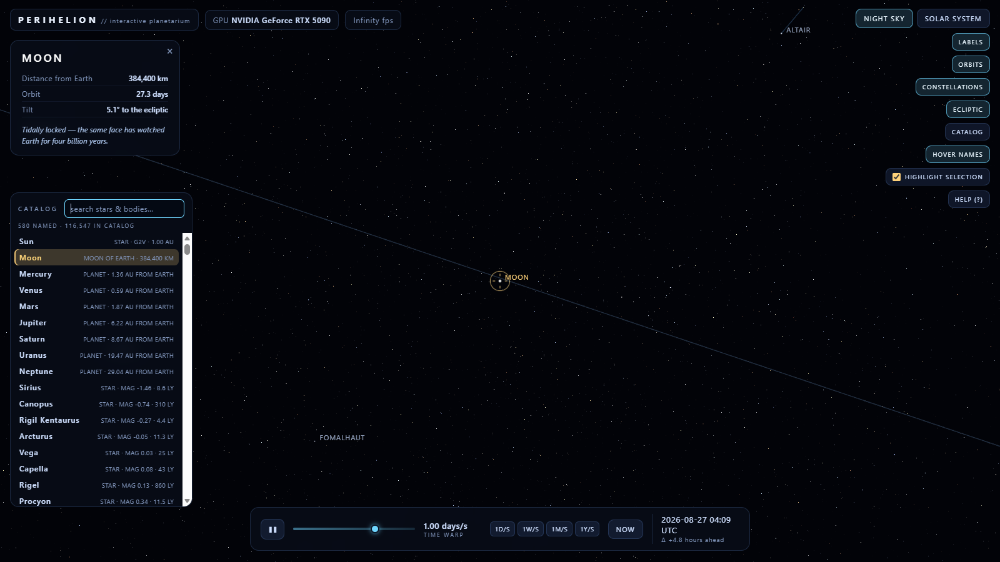

# PERIHELION — interactive 3D planetarium

A self-contained, single-page 3D planetarium that renders on your GPU (WebGL).
Built to run on the **NVIDIA GeForce RTX 5090** — the GPU badge in the top bar
shows the card actually doing the rendering.



## Run it

Just double-click **`index.html`** (any modern browser). No server, no build
step, no internet needed — everything (including the Three.js r128 library) is
local in this folder.

Optional: open a specific view directly:

```
planetarium/index.html          → night-sky mode (default, centered on Orion)
planetarium/index.html#solar    → solar-system mode
```

## What you get

**NIGHT SKY mode** (default)
- ~116,500 **real stars from the Hipparcos catalog** (ESA, public domain) —
  every point is an individually observed star with true position, magnitude
  and color; the Milky Way emerges from the real galactic-plane data.
- **Every star has an address**: all 116,508 carry their HIP number, ~98,700
  also an HD number. Hover any star to see its identity; search the catalog
  by number.
- **~3,900 named stars, searchable by name**:
  - 122 hand-curated bright stars (Sirius → Ras Algethi) with constellation
    figures, distances and facts;
  - 458 official names from the IAU Working Group on Star Names (Acamar,
    Alrakis, Gnomon, Naledi, …);
  - Bayer + Flamsteed designations for every classical star (τ Ceti, 61
    Cygni, λ Canis Majoris, …) from the HYG catalog — so `tau ceti`,
    `61 cyg` and `alpha centauri` all resolve, not just the IAU names.
- **24 constellation figures** (stick figures with name labels) — including
  all **12 zodiac signs**, which toggle as a group with `Z` — plus 6 classic
  **asterisms** (Summer Triangle, Big/Little Dipper, Teapot, Keystone,
  Northern Crown — `A`), the **ecliptic**, and the Sun, Moon and all 8
  planets in their *actual current positions* (Keplerian ephemeris computed
  in-page — no online data).
- **945 pickable deep-sky objects** — 624 galaxies (Messier + NGC), 321 open
  clusters, globular clusters, nebulae and planetary nebulae, plus ~18,400
  faint background galaxies — all real J2000 catalog data (see `SOURCES.md`).
- **Milky Way wash** (`W`): a soft, toggleable wash of the galactic plane.
- Click any star, planet or DSO for details (magnitude, B−V color index,
  distance, live RA/Dec and Earth-distance for planets).

**SOLAR SYSTEM mode** (`M` or the button)
- The Sun, 8 planets, the Moon, Saturn's rings and full orbit paths on a
  compressed radial scale (planets are not to scale with distance, or nothing
  would be visible).
- **Photo close-ups**: the planets (and the Moon) wear real 2048-px surface
  maps (public-domain NASA/JPL/USGS mosaics); click one to ride the camera
  up to the surface, then wheel back out to the system.
- **13 active space probes** on real JPL Horizons ephemerides — JWST, Parker
  Solar Probe, Juno, Solar Orbiter, BepiColombo, Psyche, Lucy, JUICE, Gaia,
  Euclid, Voyager 1 & 2, New Horizons — as procedural models at their true
  positions, searchable in the catalog (`webb`, `voyager`, `parker`), with a
  live telemetry card (Sun/Earth distance, velocity, light time). Warp the
  clock a decade out and watch them fly.
- **9 minor planets / dwarf planets** (Ceres, Vesta, Pallas, Hygiea, Pluto,
  Eris, Haumea, Makemake, and the dwarf-planet candidate 28978 Ixion) on real
  osculating orbits (JPL Horizons, DE440-class, epoch 2026-08-30; moons
  re-derived from J2000 state vectors), and **11 major moons** (Io…Callisto,
  Phobos, Deimos, Titan, Rhea, Iapetus, Triton, Charon) orbiting their
  parents with labels, orbits and catalog entries. The whole group toggles
  with `P` (MINORS).
- Free orbit camera — click a planet to make the camera follow it.

**In both modes**
- **Catalog** (`K`): searchable drawer over the whole 116,508-star Hipparcos
  catalog, the 945 deep-sky objects, the Sun, Moon, 8 planets, 9 minor
  planets, 11 major moons, and the 13 probes. Search by proper name, Bayer
  or Flamsteed designation (`tau ceti`, `61 cyg`), **HIP** number or **HD**
  number (e.g. `sirius`, `acamar`, `60718`, `18622`, `m31`, `ceres`,
  `triton`, `webb`, `voyager`) — the
  results show the object's ID and magnitude/distance, and clicking one
  selects it, highlights the row, and smoothly flies the camera to it (in
  solar mode the camera follows the body instead). The catalog is also
  openable via URL: `index.html#q=sirius`.
- **Selection marker** (checkbox in the right column, or `X`): a gently
  pulsing gold reticle stays pinned to whatever you select — a star, a planet,
  or the Moon, in which case it *tracks it as it moves* across the sky.
- **Hover names** (`T`): hover near *any* star or body to see its identity —
  a proper name where one exists, otherwise its HIP/HD address — plus a quick
  fact; toggle it off if you prefer an uncluttered sky.

**Time machine**
- Warp from 0.25× real time up to 1 year per second (slider or `[` `]`),
  one-tap presets `1D/S · 1W/S · 1M/S · 1Y/S`, and `NOW` to snap back to the
  present. Each mode auto-picks a warp on entry — sky: 1 day/s (Moon and
  planets drift realistically); solar system: 1 month/s (the whole system,
  from the Moon to Neptune, is visibly in motion). The simulated date is
  always shown in UTC.

**JOURNEYS** (`J` or the JOURNEY button)
- Travel between any two *addresses*: a city (12,171-city gazetteer,
  GeoNames, pop ≥ 50 k — type "Lon" and London appears), any body, or a star
  (e.g. `tau ceti`, with its real 3.65 pc distance).
- Pick a drive: **Apollo** (chemical, 11 km/s), **Fusion** (0.1 c),
  **Hail Mary** (0.99 c @ 2 g — the *Project Hail Mary* ship) or **Photon**
  (0.999 c). The flight runs the *real mission time* (constant accel →
  cruise → symmetric brake): London → Tau Ceti on Hail Mary is 12.5 ship
  years, and the in-game clock counts every one of those years.
- The camera flies it in four acts: a wide overview of the system, a dive to
  the departure point (a gold pin marks your city on the globe), launch — and
  then the cruise pulls back into a **schematic wide shot**: the whole route
  in frame, home system on one end, the destination star on the other, your
  ship a bright dot crossing the line while the mission clock laps the
  planets behind you (the time-warp readout switches to the mission's own
  rate; the `[` `]` keys and the flight's warp slider ×0.25–×16 speed the
  whole thing up). For the arrival the clock hands back to normal time: the
  ship is left behind at the star, and the camera makes one fast, real-time
  fly-in to the destination — orbiting the arrival star (or handing you the
  destination planet, no jump). `Esc` or `J` aborts at any point and eases
  the camera back to where it was.

## Controls

| Input | Action |
|---|---|
| drag | look around / orbit the camera |
| middle-drag / `Ctrl`+drag | strafe — slide the view sideways (solar mode; orbits in sky mode) |
| scroll | zoom — field of view (sky) or distance (solar) |
| click | select a star / planet |
| `Space` | pause / resume time |
| `[` / `]` | warp slower / faster |
| `1D/S` … `1Y/S` | one-tap warp presets (bottom bar) |
| `N` | jump to now |
| `M` | sky ↔ solar-system mode |
| `L` / `O` / `C` / `E` | labels / orbits / constellations / ecliptic |
| `Z` | zodiac figures on / off |
| `P` | minor planets & moons on / off |
| `T` | hover names on / off |
| `W` | milky way wash on / off |
| `A` | asterisms on / off |
| `K` | catalog — search & fly to any star, DSO, minor planet or moon |
| `J` | journey — travel between addresses (city, body or star) |
| `X` | selection marker on / off (checkbox in the right column) |
| `H` or `?` | help |
| `Esc` | deselect (aborts a journey in flight) |

## Regenerating star data

The committed `js/stars-hip.js` / `js/stars-named.js` are generated by the
scripts in `_build/` from the official Hipparcos main catalog:

1. Download `hip_main.csv` (~37 MB) from the
   [Lokilife/hipparcos-data](https://github.com/Lokilife/hipparcos-data)
   mirror (official archive: NASA HEASARC) and drop it into `_build/`.
   It is **not** committed to this repo — the generated JS is checked in
   instead, so nothing needs regenerating to run the app.
2. `node _build/convert.js` → `js/stars-hip.js` (the 116,508-star buffer)
3. Bayer/Flamsteed designations: download the HYG 4.2 catalog (CC BY-SA 4.0,
   <https://astronexus.com/hyg>) as `_build/hygdata_v42.csv` (gitignored),
   then `node _build/extract-hyg.mjs` → `_build/hyg-bayer-flam.csv`
   (committed — the distilled designation list).
4. `node _build/convert-named.js` → `js/stars-named.js` (HIP/HD IDs + the
   IAU-named stars from `_build/wgsn.csv` + every Bayer/Flamsteed designation
   + HYG distances for 3,304 stars, used by journeys)
5. `node _build/verify-align.js` proves the ID arrays stay byte-aligned with
   the star buffer; `test-search.js` and `test-moon.js` are sanity checks.
6. `node _build/fetch-cities.mjs` re-downloads the GeoNames `cities5000`
   gazetteer (CC-BY) and regenerates `js/cities.js` (pop ≥ 50,000).

## Notes on accuracy

- **Every star is a real, observed star** — the full Hipparcos main catalog
  (ESA, 1997, public domain), J2000 coordinates. Faint stars (V > 7) fade out
  past the naked-eye limit; nothing is procedurally generated.
- Planetary positions come from J2000 mean orbital elements (JPL approximate
  elements), good to roughly a degree — planets sit in the right constellations
  on the right nights.
- The Moon uses a low-precision lunar theory (leading terms, ~0.1° accuracy).
- A startup self-test verifies the ephemeris (the Sun at J2000.0 must land at
  RA ≈ 280.5°) and logs the result to the console.

## Layout

```
index.html          page shell
css/style.css        HUD styling
js/three.min.js     Three.js r128 (local copy)
js/data.js          orbital elements, 122 curated named stars, 24 constellation figures
js/stars-hip.js     116,508 Hipparcos stars (position, magnitude, color)
js/stars-named.js   HIP/HD IDs for every star + 458 IAU-named stars + 3,304 star distances (generated, see _build/)
js/cities.js        12,171-city gazetteer for journeys (GeoNames, CC-BY; generated, see _build/)
js/journey.js       journey engine: addresses, mission physics, flight phases, warp
js/dso.js           624 bright galaxies + 18,304 faint background galaxies (NGC/UGC/Corwin)
js/dso2.js          321 clusters/nebulae + 138 faint (SIMBAD J2000)
js/minors.js        9 minor planets + 11 major moons, osculating at 2026-08-30 (JPL Horizons)
js/probes.js        13 active probes: Horizons state vectors + T0 elements (JPL, 2026-08-31)
js/planets-textures.js  embedded 2K photo maps for 8 planets + Moon (NASA/JPL/USGS PD mosaics)
js/asterisms.js     6 classic asterisms (Dipper, Teapot, Triangle, …)
js/astro.js         Kepler solver, ephemeris, coordinate transforms
js/sky.js           celestial dome: starfield, lines, body sprites, DSOs, milky-way wash
js/solar.js         solar-system scene (planets, moons, minor planets)
js/ui.js            HUD, labels, info panel, help
js/app.js           renderer, camera, main loop
SOURCES.md          every data source + files you may need to download
plan-probes.md      plan for the next phase (probes, JWST model, planet close-ups)
_build/             data pipeline: converters + tests (hip_main.csv not committed)
_qa/                headless-browser regression suite (Chromium + Playwright)
```

**Where the data came from — and what you may need to download yourself** —
is documented in [SOURCES.md](SOURCES.md).
